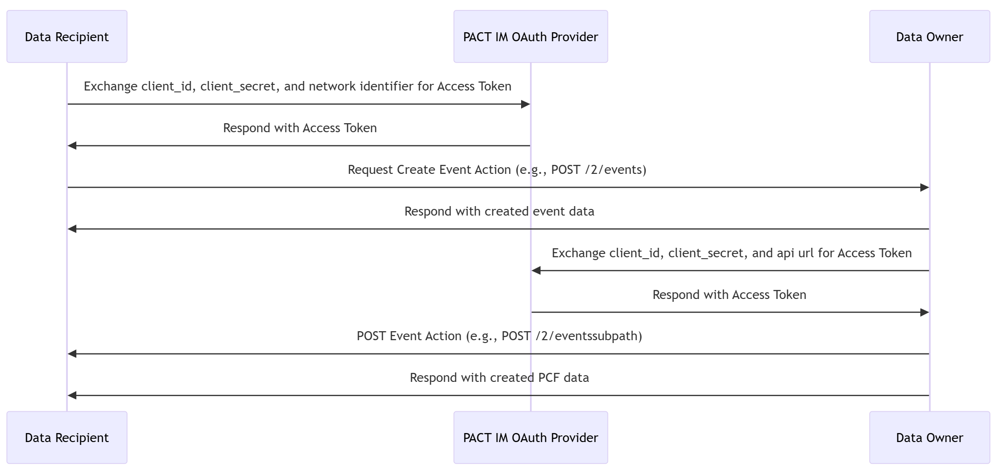
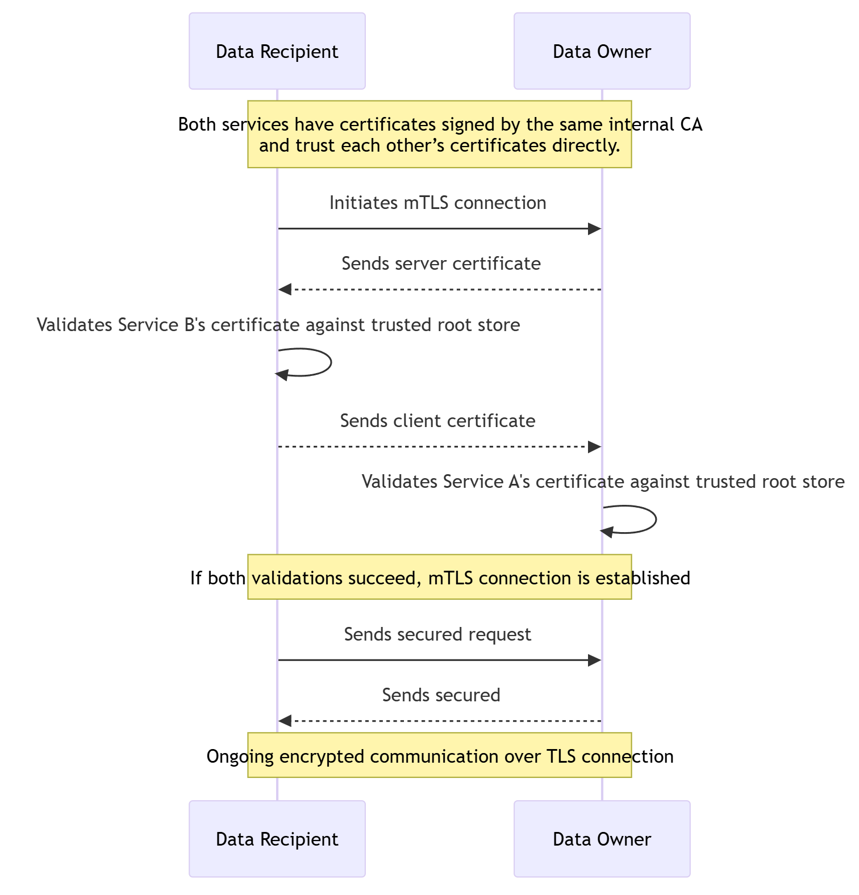

# Authentication as a Service Design

## Introduction

The purpose of this document is to outline the design of the authentication service for the PACT Network. The authentication service will be responsible for managing client authentication and authorization for the systems exchanging data within the network.

## Technical Architecture

From a high level overview the PACT Authentication Service includes three key components:

- PACT Directory: A central database or storage solution that holds information about the various organizations in the network.
- PACT Directory Portal: An interface for users within these organizations to discover and exchange PCF data. This interface also allows orgnisations to request and grant access to other organizations to their PCF data.
- PACT Authentication Service REST API: A RESTful API that allows client systems to authenticate using the OAuth 2.0 standard so they access the PACT conformant APIs in the network.

## Registering an organization in the PACT directory

When an organization wants to join the PACT network, it will need to register in the PACT Directory Portal. The registration process will involve providing the organization's name, contact information, and other relevant details. Once the organization is registered, it will be able to request and grant access to other organizations sharing PCF data through their PACT conformant APIs.

## Data access request flow

When an organization wants to access PCF data from another organization, it can request to create a connection between the two oganizations through the PACT Directory Portal. The second organization will receive an email notification directing them to PACT Directory Portal where they can grant or deny access to the requesting organization.

The authentication grant flow will be as follows:

## Credentials and Authentication

Each organization will be issued a `client_id` and `client_secret` pair that will be used to authenticate with the PACT Authentication Service. These credentials will be unique to each organization and will be used to identify the organization, and its PACT Conformant Solution, when making requests to the PACT Authentication Service to get an access token that will allow them to request PCF data from connected organizations.

When a PACT conformant API receives a request from a client system, it will validate the access token provided by the client system with the PACT Authentication Service to ensure that the client system is authorized to access the data using the `client_secret` issued by the Authentication Service to validate the access token's authenticity.

## API request (PCF data) flow

Once an organization has granted acess to another organization, the requesting organization's solution can authenticate with the PACT Authentication Service using an OAuth 2.0 flow where the requesting organization's `client_id`, `client_secret`, and the company ID (not a legal identifier, but an id issue by the authentication service during sign up) of the data owner are exchanged for an access token, then access the PCF from the organizations they have access to. This access token will have a validity period of 3 hours, after which a the client will need to request a new token. The API requests flow will be as follows:

## Async bidirectional flow

When organizations exchange data in a bidirectional manner, each organization authenticates with the PACT Authentication service using their own credentials. The PACT Authentication service will then authenticate the clients and if the organizations are connected the exchange can take place.

## Authentication Service option analysis

Besides the OAuth 2.0 authentication flow, there are other options that can be used to secure the communication between the organizations' systems in the PACT Network.

### Mutual TLS

Mutual TLS (Transport Layer Security) authentication requires both client and server to present and verify certificates. In this setup, each server authenticates the other by validating SSL/TLS certificates, adding an extra layer of security beyond standard bearer tokens. It's very secure since both servers authenticate each other with trusted certificates which adds resillience against most common attack vectors. A request flow would look like this:

### Pros of mTLS

1. **Enhanced Security and Trust**

   - mTLS provides bidirectional (mutual) authentication, meaning both client and server verify each other’s identities. This significantly reduces the risk of impersonation attacks and ensures that only authorized servers can communicate with each other.

2. **Protection Against Man-in-the-Middle (MitM) Attacks**

   - Since both the client and server authenticate each other using certificates, mTLS makes it more challenging for attackers to intercept and alter communication between parties.

3. **No Dependency on Tokens or Passwords**

   - mTLS eliminates the need for passwords, API keys, or tokens, relying instead on X.509 certificates, which are harder to steal and misuse than credentials.

4. **Ideal for Zero Trust Architectures**

   - mTLS is often a key component of Zero Trust architectures, where each request must be authenticated and authorized, regardless of network location. This aligns with security models that assume no implicit trust.

5. **Message Integrity and Confidentiality**
   - Since TLS encryption is used, mTLS also provides data confidentiality and integrity. This means data is encrypted in transit, and unauthorized parties cannot alter or read it.

### Cons of mTLS

1. **Change to the PACT Tech Specs**

   - PACT Tech Specs require OAuth, and PACT community has therefore implemented OAuth based authentication; changing to a different authentication flow would require a new major version and all implementations to upgrade, making IM non-usable until orgs have completed this implementation and therefore impractical as a choice for MVP

2. **Complexity in Certificate Management**

   - Implementing mTLS requires managing client and server certificates, including issuing, distributing, renewing, and revoking certificates. This adds operational overhead, especially in large-scale environments.

3. **Higher Setup and Maintenance Costs**

   - Unlike simpler authentication methods (like API keys or bearer tokens), setting up mTLS requires more initial configuration and ongoing maintenance, including more involvement from IT teams within the organization(s) or Solution Providers.

4. **Scalability Challenges**

   - Managing certificates for each client in large-scale deployments can be complex and may not scale as well as other methods like OAuth. Maintaining mTLS in microservices architectures, for example, can become challenging without automated certificate management.

5. **Complexity in Error Handling and Debugging**
   - Troubleshooting issues with mTLS can be more complex because both sides need valid certificates. Errors in certificate validity, expiration, or misconfiguration can lead to connection failures that are harder to diagnose than other authentication errors.

**Recommendation:** The PACT Network should use OAuth 2.0 for authentication and authorization as it is a widely adopted standard for securing APIs and provides a good balance between security and usability. Organizations can use mTLS in addition to OAuth 2.0 for an extra layer of security if needed, but at this moment it should not be the primary method of authentication as it requires more operational overhead and complexity that could result in friction to adoption, and a barrier to entry for smaller organizations.

## Proposed Tech Stack

The PACT Authentication Service, PACT Directory Portal will be built using the following technologies:

1. **Core Backend**
   - Node.js: Server environment for running JavaScript code on the backend.
   - TypeScript: Type-safe language built on JavaScript, enabling easier development with type-checking and IDE support.
2. **API Framework**
   - Express.js: Lightweight and flexible web application framework for Node.js to handle HTTP requests and routing.
3. **Authentication & Authorization**
   - node-oauth2-server: OAuth 2.0 authorization server library for Node.js, which can be used to issue and manage access tokens.
4. **Database**
   - PostgreSQL: Relational database known for its robustness, especially with large datasets, very well suited for storing user data and token-related information.
5. **Core Frontend**
   - React: JavaScript library for building interactive user interfaces.
   - TypeScript: Type-safe development in React, which enhances development productivity and reduces runtime errors.
6. **UI Component Library**
   - Radix UI: Primitives library for building accessible, unstyled UI components, offering building blocks for a highly customizable design.
