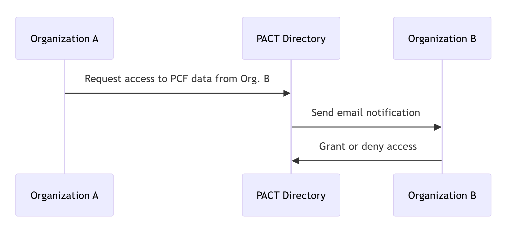
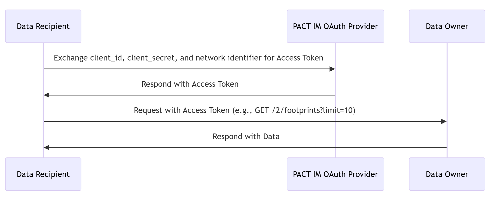

# Authentication as a Service Design

## Introduction

The purpose of this document is to outline the design of the authentication service for the PACT network. The authentication service will be responsible for managing client authentication and authorization for the systems exchanging data within the network.

## Technical Architecture

From a high level overview the PACT Authentication Service includes three key components:

- Organizations Store: A central database or storage solution that holds information about the various organizations in the network.
- PACT Directory Website: An interface for users within these organizations to discover and exchange PCF data. This interface also allows orgnisations to request and grant access to other organizations to their PCF data.
- PACT Authentication Service REST API: A RESTful API that allows client systems to authenticate using the OAuth 2.0 standard so they access the PACT conforming APIs in the network.

## Registering an organization in the PACT directory

When an organization wants to join the PACT network, it will need to register in the PACT directory website. The registration process will involve providing the organization's name, contact information, and other relevant details. Once the organization is registered, it will be able to request and grant access to other organizations sharing PCF data through their PACT compliant APIs.

## Data access request flow

When an organization wants to access PCF data from another organization, it will need to request access through the PACT directory. The second organization will receive an email notification directing them to PACT directory where they can grant or deny access to the requesting organization.

The authentication grant flow will be as follows:

## Credentials and Authentication

Each organization will be issued a `client_id` and `client_secret` pair that will be used to authenticate with the PACT Authentication Service. These credentials will be unique to each organization and will be used to identify the organization when making requests to the PACT Authentication Service to get an access token that will allow them to request PCF data from connected organizations.

When a PACT conforming API receives a request from a client system, it will validate the access token provided by the client system with the PACT Authentication Service to ensure that the client system is authorized to access the data using the `client_secret` issued by the Authentication Service to validate the access token's authenticity.

## API request (PCF data) flow

Once an organization has granted acess to another organization, the requesting organization's solution can authenticate with the PACT Authentication Service using an OAuth 2.0 flow where a `client_id`, `client_secret`, and the api url from the data source API are exchanged for an access token, then access the PCF from the organizations they have access to. The API requests flow will be as follows:

## Async bidirectional flow

When organizations exchange data in a bidirectional manner, each organization authenticates with the PACT Authentication service using their own credentials. The PACT Authentication service will then authenticate the clients and if the organizations are connected the exchange can take place.

## Authentication Service options analysis (OAuth, DNS, Certificates), pros/cons and recommendation

[In Progress]
